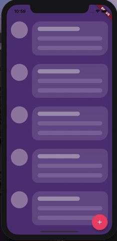
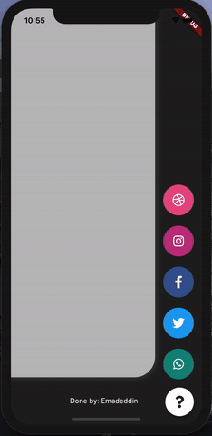

# Animated Stack

Custom animated stacked pages, to create customisable side menu buttons.
Providing simple menu for sharing buttons, side menu, message sending, about page, ... etc.

 

## Getting Started
At first, you have to create Foreground and Background Widgets.

Here is a simple example to meet minimum requirements.

```dart
class MyApp extends StatelessWidget {
  @override
  Widget build(BuildContext context) {
    return MaterialApp(
      title: 'Animated Stack Demo',
      theme: ThemeData(
        splashColor: Colors.transparent,
        highlightColor: Colors.transparent,
      ),
      home: AnimatedStack(
        backgroundColor: Colors.white,
        fabBackgroundColor: Colors.black,
        foregroundWidget: ..., // Main page
        columnWidget: ..., // Right widget, preferably Column
        bottomWidget: ...,// Right widget, preferably Row
      ),
    );
  }
}
```

## Complete Features

Here's all what you can customize in this widget!

## Button attributes

```dart
AnimatedStack(
    backgroundColor: ...,     // Background Container color
    foregroundWidget: ...,    // Foreground Container color

    columnWidget: ...,        // Right Widget, (use Column for best results)
    bottomWidget: ...,        // Bottom Widget, (use Row for best results)

    scaleHeight: 100,         // Sliding animation height, default is 60
    scaleWidth: 100,          // Sliding animation width, default is 60


    buttonIcon: ...,          // FAB icon (IconData)
    fabIconColor: ...,        // FAB icon color
    animateButton: false,     // Sometimes, we don't want to animate the button!
    fabBackgroundColor: ...,  // FAB background color

    slideAnimationDuration: ..., // Animation Duration, default is 800 Milliseconds
    buttonAnimationDuration: ...,// Animation Duration, default is 240 Milliseconds

    openAnimationCurve: ...,    // Animation Curve, default is ElasticOutCurve(0.9)
    closeAnimationCurve: ...,   // Animation Curve, default is ElasticInCurve(0.9)
    );
```

### For complete examples, check example folder

## License
MIT License.
